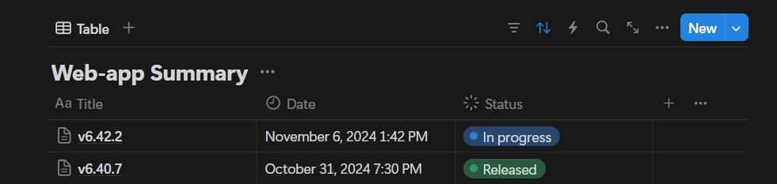
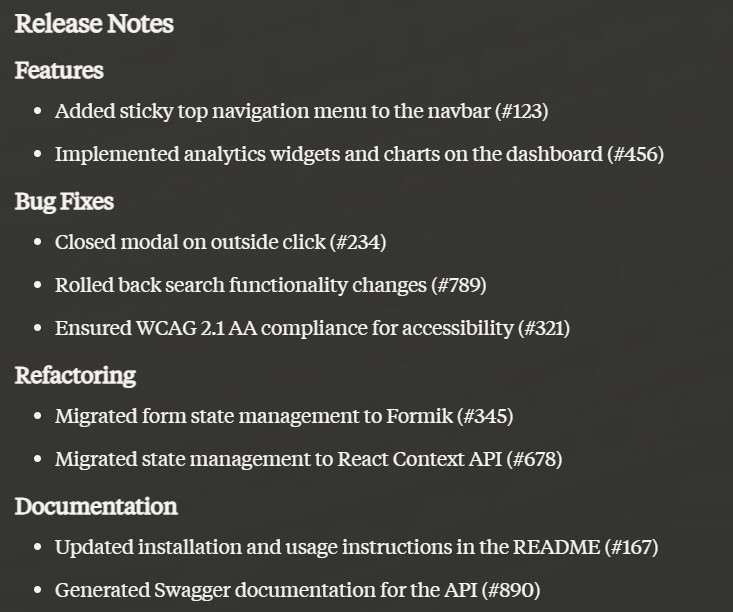

# pr-summary-github-action

This GitHub Action summarizes commit messages from a pull request (PR) and posts the summary to Notion. It can be configured to integrate with other services such as OpenAI, Anthropic, and Linear for enhanced processing and output management.

> **! IMPORTANT**
>
> - This action works only with pull requests.
> - When checking out the code, make sure to use the `fetch-depth: 0` option. Check example below. [Read more](https://github.com/actions/checkout?tab=readme-ov-file#fetch-all-history-for-all-tags-and-branches)

## Linear

When using Linear, you need to create a view from which the tasks will be pulled from.
In the future we will allow more customization of the task/issue management tool query parameters for fetching issues.

## Notion

> **! IMPORTANT**
>
> - To post to a Notion database, please allow your API integration access to the database. [Read more](https://developers.notion.com/docs/create-a-notion-integration)
> - One of the properties of the database needs to have an ID of `Title`.



## Inputs

- **`ghToken`** (required): GitHub token for authentication.
- **`openAiKey`** (optional): OpenAI API key. Ignored if empty.
- **`openAiOrg`** (optional): OpenAI organization ID.
- **`openAiModel`** (optional): OpenAI model to use (e.g. gpt-4o, gpt-3.5-turbo). Default: gpt-4o
- **`anthropicKey`** (optional): Anthropic API key. Ignored if empty.
- **`anthropicModel`** (optional): Anthropic model to use (e.g. claude-3-opus-20240229, claude-3-5-sonnet-20240620). Default: claude-3-5-sonnet-20240620.
- **`deepseekKey`** (optional): Deepseek API key. If empty it will be ignored.
- **`deepseekModel`** (optional): Deepseek model to use (e.g. deepseek-chat, deepseek-reasoner). Default: deepseek-chat.
- **`geminiKey`** (optional): Gemini API key. If empty it will be ignored.
- **`geminiModel`** (optional): Gemini model to use (e.g. gemini-2.0-flash, gemini-1.5-pro). Default: gemini-2.0-flash.
- **`linearKey`** (optional): Linear API key. Ignored if empty.
- **`linearViewId`** (optional): Linear view ID. This allows you to specify a custom view for fetching issues that can be modified to your needs.
- **`notionKey`** (optional): Notion API key.
- **`notionDbId`** (optional): Notion database ID.
- **`prompt`** (optional): Prompt to use for summarizing commits. Default: "Provide a detailed summary of the following commit messages in markdown format."
- **`file`** (optional): Path to a text file containing information that will be used for summarization instead of commit messages or linear issues. This way you can fetch this information from any source, write it to a file, and pass it to the action.
- **`changelog`** (optional): Link to the changelog. Will be added to the notion document.
- **`prLink`** (optional): Link to the PR. Will be added to the notion document.
- **`version`** (optional): Release version. Will be added to the notes.

## Outputs

- **`summary`**: The resulting release summary.

> **! IMPORTANT**
>
> - This action works only with pull requests.
> - When checking out the code, make sure to use the `fetch-depth: 0` option. [Read more](https://github.com/actions/checkout?tab=readme-ov-file#fetch-all-history-for-all-tags-and-branches)
> - To post to notion database please allow you API integration access to the database.
>   [Read more](https://developers.notion.com/docs/create-a-notion-integration)

## Example usage

Here's an example of how to use this action within a GitHub workflow:

```yaml
name: release

name: Release Production
on:
  pull_request:
    branches: [main]
    types:
      - opened
  workflow_dispatch:

jobs:
  build:
    name: Running ci
    if: "github.event.pull_request.draft != true"
    runs-on: ubuntu-latest
    env:
      CI: true

    steps:
      - name: 🛒 Checkout code
        uses: actions/checkout@v4
        with:
          fetch-depth: 0

      - name: 📄 PR summary
        id: summary
        uses: nejcm/pr-summary-github-action@v1.1.5
        with:
          ghToken: ${{ secrets.GH_TOKEN }}
          anthropicKey: ${{ secrets.ANTHROPIC_KEY }}
          notionKey: ${{ secrets.NOTION_KEY }}
          notionDbId: ${{ secrets.NOTION_DB_ID }}
          linearKey: ${{ secrets.LINEAR_KEY }}
          linearViewId: ${{ secrets.LINEAR_VIEW_ID }}
          file: './path/to/your/file.txt'
          version: 'v1.0.0'
          changelog:
            '${{ github.server_url }}/${{ github.repository }}/blob/${{ github.head_ref }}/CHANGELOG.md'
          prLink:
            '${{ github.server_url }}/${{ github.repository }}/pull/${{ github.event.pull_request.number }}'
          prompt: "Provide a set of Release Notes in Markdown format based on the following list of tasks that have been exported from Linear: "

      - name: 💬 Post summary comment
        if: steps.summary.outcome == 'success' && steps.summary.outputs.summary != ''
        uses: marocchino/sticky-pull-request-comment@v2
        with:
          GITHUB_TOKEN: ${{ secrets.GH_TOKEN }}
          number: ${{ github.event.pull_request.number }}
          header: "Release Summary"
          message: |
            ${{ steps.summary.outputs.summary }}
```

## Example output



## TODO

- [ ] Add support for other task/issue management tools
- [ ] Add support for other LLM providers
  - [x] Allow different model selection
  - [x] DeepSeek
  - [x] Gemini
  - [ ] Qween
